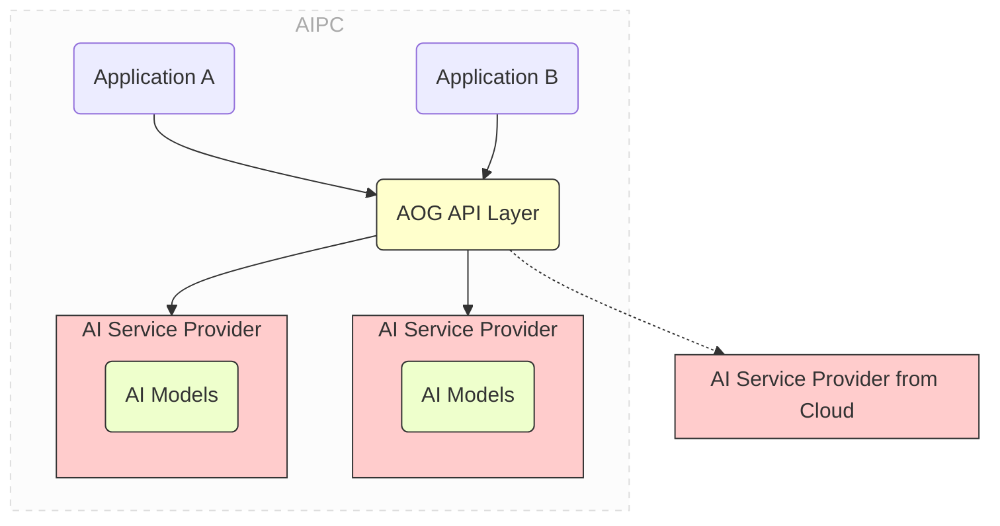

# AOG (AIPC Open Gateway) Preview

中文 | [English](README_en.md)

当前为 AOG 预览版 v0.3.0，更多功能和稳定性正在不断完善过程中。欢迎就发现的缺陷提交 Issues。

当前版本支持 chat、embed、text_to_image 服务，下层支持 ollama 和 openvino model server。更多服务如视频、音频相关，以及其他 AI 引擎，敬请
期待正在开发的后续版本。

## AOG 的功能

AOG（AIPC Open Gateway）的目标是解耦 AI PC 上的 AI 应用与它所依赖的 AI 服务。它旨在为开发者提供一个
极其简单易用的基础设施，以便他们在开发环境中安装本地 AI 服务，并发布他们的 AI 应用程序，无需打包自己
的 AI 堆栈和模型。



通过 AOG 提供统一的平台级的 AI 服务，AI 应用不再需要随自己的程序一起打包和发布 AI 引擎及模型。同时
，AI PC 上的多个 AI 应用使用统一的 AOG 提供的 AI 服务，因而无需冗余地部署和启动自己的 AI 栈。这显著
减少了应用大小，消除了每个应用重复下载相同 AI 栈和模型的情况，并在执行过程中避免了内存消耗的竞争。

AOG 提供以下基本功能：

- 一站式 AI 服务安装

  - 在开发过程中，开发者可以通过简单的命令如 `aog install chat` 或
    `aog pull-model deepseek-r1:1.5b for chat` ， 在他们的开发环境中本地安装 AI 服务。AOG 会自动下载
    并安 装最合适和优化的 AI 堆栈（例如 `ollama` 或 `openvino` ）和模型

  - 在部署过程中，开发者可以无需打包依赖的 AI 栈和模型即可发布他们的 AI 应用程序。AOG 将在需要时自动
    为部署的 PC 拉取所需的 AI 栈和模型。

- 解耦应用程序和 AI 服务提供商，通过共享服务和标准 API

  - AOG API 层提供了标准化 API，用于典型 AI 服务如聊天、嵌入等。开发者专注于其应用程序的业务逻辑，无
    需过 多关注底层 AI 服务栈。

  - AI 服务按平台提供，由同一系统上的多个应用程序共享。这避免了每个应用程序重复下载相同的 AI 服务栈
    和模 型，减少了内存消耗的竞争。

- 自动 API 转换，适配流行的 API 风格

  - 此外，AOG API 层还提供在流行的 API 风格（例如 OpenAI API）与 AOG 提供的 AI 服务之间的自动 API 转
    换。 这样一来，开发者可以轻松地将现有的基于云 AI 的应用程序迁移到基于 AOG 的 AIPC 应用程序。

- 本地与云 AI 服务提供商之间的混合调度

  - AOG 允许开发者在本地开发环境中安装 AI 服务。这些服务可以通过 AOG API 层进行访问。

## 构建 AOG 命令行工具

作为开发者，为了构建 AOG，您需要在您的系统上安装 [golang](https://go.dev/)。

如果您的开发环境是 Windows，您可能需要安装 [MSYS2](https://www.msys2.org) ，以获得 Make 等命令。

接着，将此项目下载或克隆到如 `/path_to_aog` 的目录中。

然后运行以下命令：

```sh
cd /path_to_aog

make build-all
```

这将生成一个名为 aog 的可执行文件，它是 AOG 的命令行。

## 使用 AOG 命令行工具

您可以通过输入 `aog -h` 来查看命令行工具的帮助信息。

使用命令启动和停止 AOG 服务

```sh
# 前台启动AOG
aog server start

# 后台启动AOG
aog server start -d

# Debug模式启动
aog server start -v

# 停止AOG
aog server stop

```

AOG 有两个关键概念：**服务(Service)** 和 **服务提供商(Service Provider)**：

- 服务是一组 AI 功能，例如聊天 (chat)、嵌入(embed) 等，提供 RESTful 接口供应用程序调用使用。
- 服务提供商是实现并提供服务的具体实体。服务提供商可以是本地或远程的。

一个服务可以有多个服务提供商。例如，聊天服务可以同时有本地聊天服务提供商和远程聊天服务提供商。 其中
本地服务提供商由 ollama 提供，远程服务提供商由远程的 DeepSeek 或者通义千问提供。当应用程序使用 AOG
的 RESTful API 调用聊天服务的时候，AOG 会根据一定的规则， 自动选择合适的服务提供商，来完成该服务的真
正调用。

作为开发者，可以通过如下命令来快速安装、导入和配置相应的 AOG 服务和服务提供商

```sh
# 将 AI 服务安装到本地
# AOG 将安装必要的 AI 堆栈（如 ollama/openvino）和 AOG 推荐的模型
aog install chat
aog install embed
aog install text_to_image

# 除了默认的模型之外，您可以在服务中安装更多的模型
aog pull <model_name> -for <service_name> --provider <provider_name>

# 获取服务信息，可查看指定服务，未指定则输出全部服务信息
aog get services <service_name>


# 修改服务配置
# hybrid_policy 指定具体服务的调度策略，可选值有 always_local, always_remote, default
# remote_provider 指定远程服务提供商
# local_provider 指定本地服务提供商
aog edit service <service_name> --hybrid_policy always_remote --remote_provider xxx --local_provider xxx


# 获取服务提供商信息，可设置可选参来获取指定服务提供商信息
aog get service_providers --service <service_name> --provider <provider_name> --remote <local/remote>

# 获取模型信息，可设置可选参获取指定模型信息
aog get models --provider <provider_name>

# 安装服务提供商， 安装过程中会自动拉取模型
aog install service_provider -f xx/xxx.json
# 文件名不作要求，内容需为json格式，示例：
{
    "provider_name": "local_ollama_chat"
    "service_name": "chat",
    "service_source": "local",
    "desc": "Local ollama chat/completion",
    "api_flavor": "ollama",
    "method": "POST",
    "url": "http://localhost:11434/api/chat",
    "auth_type": "none",
    "auth_key": "",
    "models": [
        "qwen2.5:0.5b",
        "qwen2:0.5b"
    ]
}

# 修改服务提供商配置，这里仅可修改服务商配置信息，模型变更需通过拉取模型和删除模型来进行
aog edit service_provider <provider_name> -f xxx/xxx.json
# 示例：
{
    "provider_name": "local_ollama_chat"
    "service_name": "chat",
    "service_source": "local",
    "desc": "Local ollama chat/completion",
    "api_flavor": "ollama",
    "method": "POST",
    "url": "http://localhost:11434/api/chat",
    "auth_type": "none",
    "auth_key": "",
}

# 删除服务提供商
aog delete service_provider <provider_name>

# 删除模型 必选参数：--provider
aog delete model <model_name>  --provider <provider_name>
```

## 调用 AOG API

AOG API 是一个 Restful API。您可以通过与调用云 AI 服务（如 OpenAI）类似的方式调用该 API。详细的 API
规范请参见 AOG API 规范.

值得注意的是，当前 AOG 预览提供了基本的 chat 等服务，下一版本将会提供视频、音频相关的更多服务。
当前版本的文生图服务基于 OpenVION 实现（仅支持 Windows 系统），通过 modelscope 拉取openvino转换过的 IR 格式的文生图模型提供服务。 

例如，您可以使用 `curl` 在 Windows 上测试聊天服务。

```sh
curl -X POST http://localhost:16688/aog/v0.3/services/chat  -X POST -H
"Content-Type: application/json" -d
"{\"model\":\"deepseek-r1:7b\",\"messages\":[{\"role\":\"user\",\"content\":\"why is
the sky blue?\"}],\"stream\":false}"
```

此外，如果您已经使用 OpenAI API 或 ollama API 等的应用程序，您无需重写调用 AOG 的方式以符合其规范。

因为 AOG 能够自动转换这些流行风格的 API，因此您只需更改端点 URL，就可以轻松迁移应用程序。

例如，如果您使用的是 OpenAI 的聊天完成服务，您只需将端点 URL 从
`https://api.openai.com/v1/chat/completions` 替换为
`http://localhost:16688/aog/v0.3/api_flavors/openai/v1/chat/completions`。

NOTE 请注意，调用 AOG 的新 URL 位于 `api_flavors/openai` ，其余 URL 与原始 OpenAI API 相同，即
`/v1/chat/completions` 。

如果您使用 ollama API，可以将端点 URL 从 `https://localhost:11434/api/chat` 替换为
`http://localhost:16688/aog/v0.3/api_flavors/ollama/api/chat` 。同样，它位于 `api_flavors/ollama` ，
其余 URL 与原始 ollama API 相同，即 `/api/chat`。

## 发布您的基于 AOG 的 AI 应用

要将您的 AI 应用程序发布，您只需将应用程序与一个微小的 AOG 组件打包，即所谓的 `AOG Checker` ，在
Windows 上是 `AOGChecker.dll` 。您不需要发布 AI 堆栈或模型。

以 C/C++/C#应用程序为例，以下是部署基于 AOG 的 AI 应用的步骤。

1. 准备与您的应用程序一起的 `.aog` 文件。 `.aog` 文件是一个文本清单文件，用于指定应用程序所需的 AI
   服务和模型。例如， `.aog` 文件可能看起来像这样：

```json
{
  "version": "0.2",
  "service": {
    "chat": {
      "models": ["qwen2.5:0.5b", "qwen2.5:7b"]
    },
    "text_to_image": {
      "models": ["OpenVINO/stable-diffusion-v1-5-fp16-ov"]
    }
  }
}
```

2. 在您的 `main()` 函数中包含 `AOGChecker.h` 并调用 `AOGInit()` 。 `AOGInit()` 将：

   - 检查目标 PC 上是否已安装 AOG。如果没有，将自动下载并安装 AOG。
   - 检查所需的 AI 服务和模型（如在 `.aog` 文件中体现）是否已安装。如果没有，将自动下载并安装它们。

3. 将应用程序与 `aog.dll` 链接。

4. 将应用程序与 `.aog` 文件以及与您的应用程序 `.exe` 文件在同一目录下的 `AOGChecker.dll` 文件一起发
   布。
