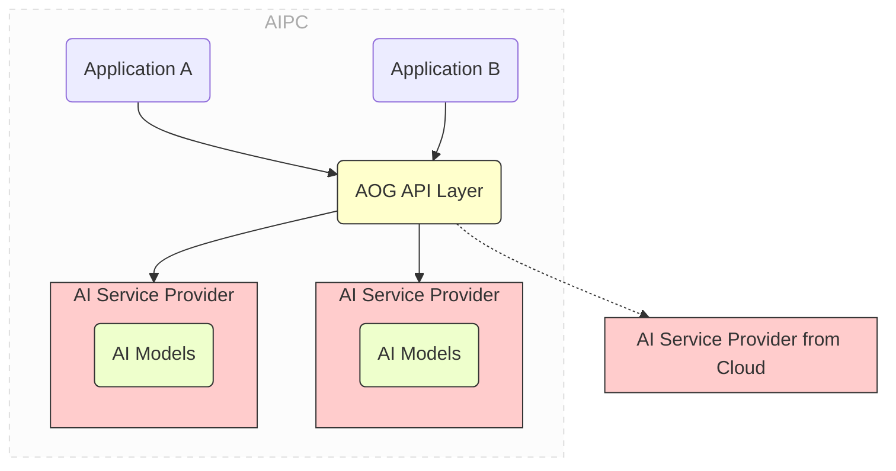

# AOG (AIPC Open Gateway) Preview

[中文](README.md) | English

This is the preview version v0.2.0 of AOG. More features and stability are continuously being
improved. Please submit Issues for any defects found.

The current version supports chat and embed services, with ollama supported at the lower level. More
services such as text-to-image, audio-related, and other AI engines are under development in
subsequent versions, so stay tuned.

## Features of AOG

AOG (AIPC Open Gateway) aims to decouple AI applications on AI PCs from the AI services they rely
on. It is designed to provide developers with an extremely simple and easy-to-use infrastructure to
install local AI services in their development environments and publish their AI applications
without packaging their own AI stacks and models.



By providing unified platform-level AI services through AOG, AI applications no longer need to
package and publish AI engines and models with their own programs. Meanwhile, multiple AI
applications on an AI PC use unified AI services provided by AOG, thus eliminating the need to
redundantly deploy and start their own AI stacks. This significantly reduces application size,
eliminates redundant downloads of the same AI stacks and models by each application, and avoids
competition for memory consumption during execution.

AOG provides the following basic features:

- One-stop AI service installation

  - During development, developers can install local AI services in their development environments
    through simple commands such as `aog install chat` or
    `aog pull-model deepseek-r1:1.5b for chat`. AOG will automatically download and install the most
    suitable and optimized AI stack (e.g., `ollama`) and models.
  - During deployment, developers can publish their AI applications without packaging dependent AI
    stacks and models. AOG will automatically pull the required AI stacks and models for the
    deployed PC when needed.

- Decoupling applications and AI service providers through shared services and standard APIs

  - The AOG API layer provides standardized APIs for typical AI services such as chat and embedding.
    Developers focus on the business logic of their applications without paying too much attention
    to the underlying AI service stack.
  - AI services are provided by the platform and shared by multiple applications on the same system.
    This avoids redundant downloads of the same AI service stacks and models by each application,
    reducing competition for memory consumption.

- Automatic API conversion to adapt to popular API styles
  - In addition, the AOG API layer also provides automatic API conversion between popular API styles
    (e.g., OpenAI API) and AI services provided by AOG. This allows developers to easily migrate
    existing cloud-based AI applications to AOG-based AIPC applications.
- Hybrid scheduling between local and cloud AI service providers
  - AOG allows developers to install AI services in local development environments. These services
    can be accessed through the AOG API layer.

## Building the AOG Command-Line Tool

As a developer, to build AOG, you need to install [golang](https://go.dev/) on your system.

If your development environment is Windows, you may need to install [MSYS2](https://www.msys2.org)
to get commands like Make.

Next, download or clone this project to a directory such as `/path_to_aog`.

Then run the following commands:

```bash
cd /path_to_aog

make build-all
```

This will generate an executable file named aog, which is the AOG command line.

## Using the AOG Command-Line Tool

You can view the help information of the command-line tool by entering `aog -h`.

Use commands to start and stop the AOG service

```bash
# Start AOG in the foreground
aog server start

# Start AOG in the background
aog server start -d

# Stop AOG
aog server stop
```

AOG has two key concepts: **Service** and **Service Provider**:

- A **service** is a set of AI functions, such as chat and embedding, that provide RESTful
  interfaces for applications to call.
- A **service provider** is the specific entity that implements and provides the service. Service
  providers can be local or remote.

A service can have multiple service providers. For example, a chat service can have both local and
remote chat service providers. The local service provider is provided by ollama, and the remote
service provider is provided by remote DeepSeek or Tongyi Qianwen. When an application calls the
chat service using the AOG RESTful API, AOG will automatically select the appropriate service
provider according to certain rules to complete the actual call of the service.

As a developer, you can quickly install, import, and configure the corresponding AOG services and
service providers through the following commands:

```sh
# Install AI services locally
# AOG will install the necessary AI stack (such as ollama) and AOG-recommended models
aog install chat
aog install embed

# In addition to the default models, you can install more models in the service
# The current version only supports pulling models based on ollama
# Version v0.3 will support more AI stacks and models, as well as other services
aog pull <model_name> -for <service_name> --provider <provider_name>

# Get service information, you can view the specified service, if not specified, output all service information
aog get services <service_name>

# Modify service configuration
# hybrid_policy   specifies the scheduling policy of the specific service, 
# 			      the optional values are always_local, always_remote, default
# remote_provider specifies the remote service provider
# local_provider  specifies the local service provider
aog edit service <service_name> --hybrid_policy always_remote --remote_provider xxx --local_provider xxx

# Get service provider information, you can set optional parameters to get the specified service provider information
aog get service_providers --service <service_name> --provider <provider_name> --remote <local/remote>

# Get model information, you can set optional parameters to get the specified model information
aog get models --provider <provider_name>

# Install service provider, the model will be automatically pulled during the installation process
aog install service_provider -f xx/xxx.json
# The file name is not required, the content must be in JSON format, example:
{
  "provider_name": "local_ollama_chat"
  "service_name": "chat",
  "service_source": "local",
  "desc": "Local ollama chat/completion",
  "api_flavor": "ollama",
  "method": "POST",
  "url": "http://localhost:11434/api/chat",
  "auth_type": "none",
  "auth_key": "",
  "models": [
    "qwen2.5:0.5b",
    "qwen2:0.5b"
  ]
}

# Modify service provider configuration, here you can only modify the service provider configuration information, 
# model changes need to be done by pulling models and deleting models
aog edit service_provider <provider_name> -f xxx/xxx.json
# Example:
{
  "provider_name": "local_ollama_chat"
  "service_name": "chat",
  "service_source": "local",
  "desc": "Local ollama chat/completion",
  "api_flavor": "ollama",
  "method": "POST",
  "url": "http://localhost:11434/api/chat",
  "auth_type": "none",
  "auth_key": ""
}

# Delete service provider
aog delete service_provider <provider_name>

# Delete model Required parameter: --provider
aog delete model <model_name>  --provider <provider_name>
```

## Calling the AOG API

The AOG API is a Restful API. You can call this API in a way similar to calling cloud AI services
(such as OpenAI). For detailed API specifications, please refer to the AOG API specifications.

It is worth noting that the current AOG preview provides basic chat and other services, and the next
version will provide more services related to text-to-image and voice.

For example, you can use `curl` to test the chat service on Windows.

```sh
curl -X POST http://localhost:16688/aog/v0.2/services/chat -X POST 
  -H "Content-Type: application/json" 
  -d "{\"model\":\"deepseek-r1:7b\",\"messages\":[{\"role\":\"user\",\"content\":\"why is the sky blue?\"}],\"stream\":false}"
```

Furthermore, if you are already using applications with OpenAI API or ollama API, etc., you do not
need to rewrite the way you call AOG to comply with its specifications.

Because AOG can automatically convert these popular API styles, you can easily migrate your
application by simply changing the endpoint URL.

For example, if you are using OpenAI's chat completion service, you only need to replace the
endpoint URL from `https://api.openai.com/v1/chat/completions` to
`http://localhost:16688/aog/v0.2/api_flavors/openai/v1/chat/completions`.

NOTE Please note that the new URL for calling AOG is located at `api_flavors/openai`, and the rest
of the URL is the same as the original OpenAI API, i.e., `/v1/chat/completions`.

If you are using the ollama API, you can replace the endpoint URL from
`https://localhost:11434/api/chat` to `http://localhost:16688/aog/v0.2/api_flavors/ollama/api/chat`.
Similarly, it is located at `api_flavors/ollama`, and the rest of the URL is the same as the
original ollama API, i.e., `/api/chat`.

## Publishing Your AOG-Based AI Application

To publish your AI application, you only need to package the application with a tiny AOG component,
the so-called `AOG Checker`, which is `AOGChecker.dll` on Windows. You do not need to publish the AI
stack or models.

Taking a C/C++/C# application as an example, the following are the steps to deploy an AOG-based AI
application.

1. Prepare the `.aog` file along with your application. The `.aog` file is a text manifest file that
   specifies the AI services and models required by the application. For example, the `.aog` file
   might look like this:

```json
{
  "version": "0.2",
  "service": {
    "chat": {
      "models": ["qwen2.5:0.5b", "qwen2.5:7b"]
    },
    "text-to-image": {
      "models": ["stable-diffusion-1.5-int4"]
    }
  }
}
```

1. Include `AOGChecker.h` and call `AOGInit()` in your `main()` function. `AOGInit()` will:
   - Check if AOG is installed on the target PC. If not, it will automatically download and install
     AOG.
   - Check if the required AI services and models (as represented in the `.aog` file) are installed.
     If not, it will automatically download and install them.
2. Link the application with `aog.dll`.
3. Publish the application along with the `.aog` file and the `AOGChecker.dll` file in the same
   directory as your application's `.exe` file.
