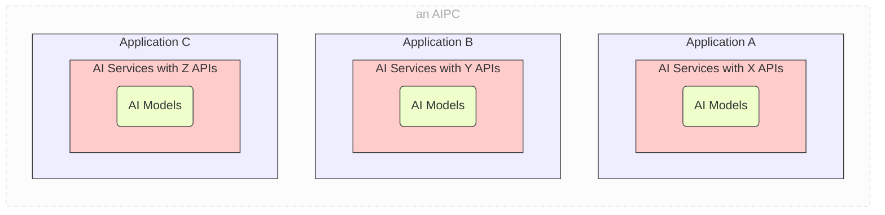
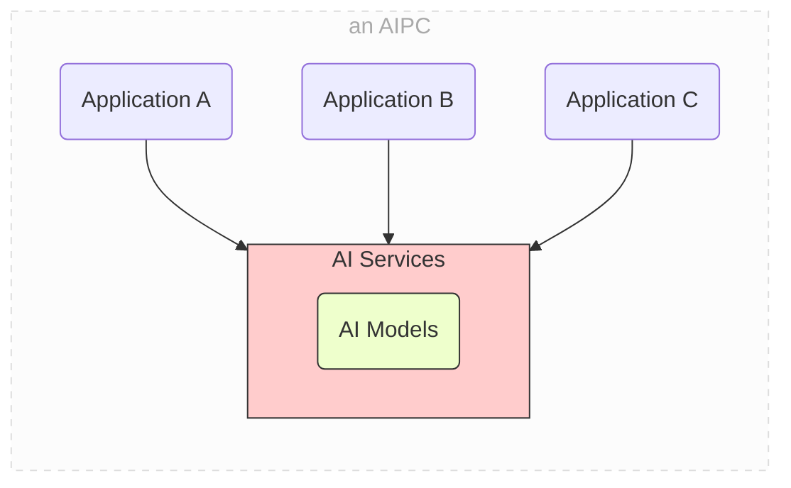
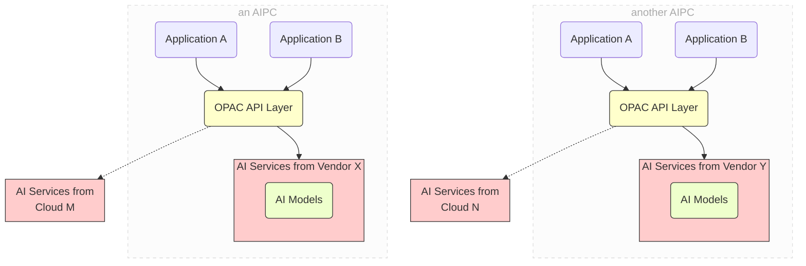
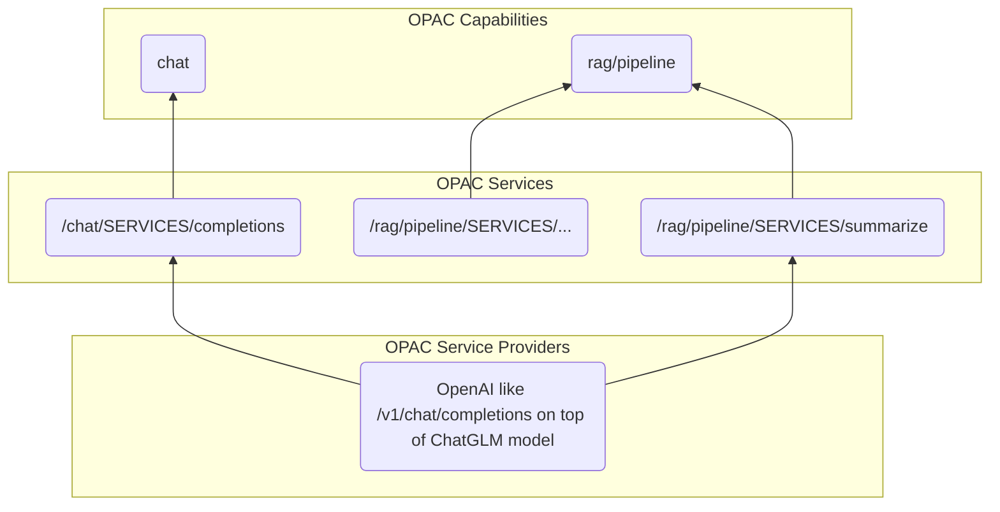
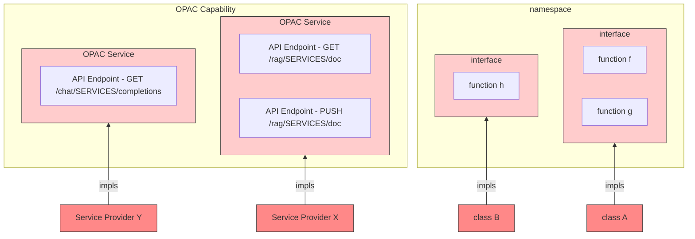
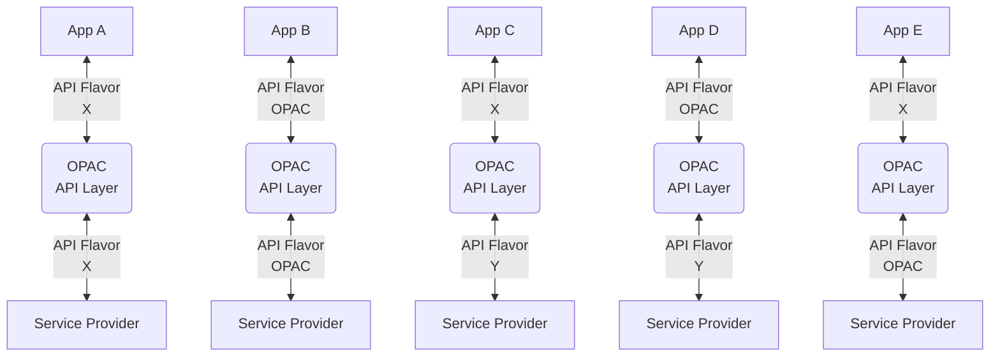
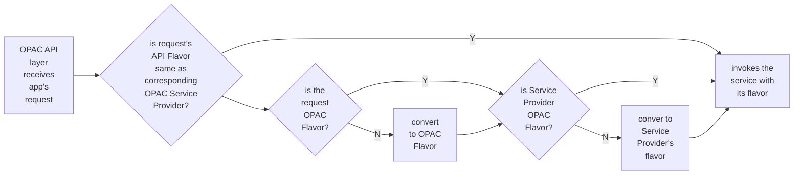
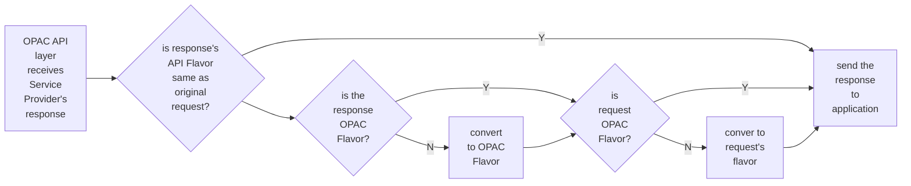

# OPAC API Design

Intel Confidential - Covered by NDA/CNDA

## Table Of Contents

[TOC]


## OPAC - Open Platform for AIPC

### Decoupling AI Application from General AI Services

Today, a lot of applications, when need certain AI related features such as "Help Me Write", they have to integrate everything from the ground and eventually ship everything within its application as a monolithic distribution package. For example, the application package may need to ship the LLM model, the ollama inferencing and serving framework, along with the rest of the application.



This results in a situation on AIPC as illustrated in above diagram. On a PC, each AI related application comes with its models and related AI frameworks. We call this `app ships everything` pattern. Such pattern faces several challenges:

* The model and AI frameworks shipped with app probably are tuned or optimized for one platform (e.g. AIPC from a specific vendor), but not for other platforms
* Each AI application becomes very fat which takes much more time to download or upgrade. And many applications together will consume remarkable disk storage on the PC.
* Given AIPC has limited computation (CPU, GPU, NPU) resource and memory, it will be hard for these AI applications to run simultaneously if each of them need to host its own AI models. They have to compete resource with each other.

In fact, except for a small portion of AI related applications, a lot of applications only depend on quite general AI services. For example, multiple applications on the same AIPC may all need to edit text somewhere inside the applications. They all can be benefited if the platform provides a shared, optimized and general "Help Me Write" AI service, as illustrated by the diagram below. They don't need to ship everything by themselves.



This new pattern decouples the AI applications from general AI Services. The applications can focus on its own features, and invoke the AI services provided by the platform when needed. It mitigates the above challenges in `app ships everything` pattern.

### OPAC Unified Architecture and API for AI Applications

While this new trend of decoupling AI applications from general AI services resolves the pain points of `app ships everything`, it raises couple new engineering level problems:

* **Compatibility** - the application need to invoke the AI services which are not shipped by its own. However, AI services provided by different vendors might define different APIs to invoke. The application has to adapt to APIs of AI services on each platform to distribute and deploy.
* **Availability** - the application can be installed on a PC without the dependent AI services provided. Even the PC has such AI services provided, occasionally it can be too busy to respond the request from the application. In either case, the application need to switch to use AI service provided by remote, e.g. cloud or edge server.

**OPAC** (**O**pen **P**latform for **A**IP**C**) proposes an unified architecture and API layer to tackle these two problems. 

* OPAC defines an unified `OPAC API` specification for most of general AI services. 
* Architecture level, the applications now send their AI requests to `OPAC API Layer` first. The `OPAC API Layer` will dispatch the requests to the suitable AI services.
  * **Address Compatibility Issue** - In ideal case, applications will use `OPAC API`. Underlying AI services, no matter from which provider, will also follow `OPAC API`, so there is no compatibility issue and the applications can run on any platform. However, in reality, it is possible that some applications or the actual service providers don't follow `OPAC API`. See [API Flavor](#api-flavor-of-opac-service-provider) for more details. In such situation, `OPAC API Layer` will try to do necessary conversions to help the application adapt to the actual underlying AI service. Such conversion is achievable because that most of the APIs used by applications or service providers, even they may be not exactly the same, are probably very similar as OpenAI's API. In this way, applications still run most of the platforms providing AI services, even its API not fully compatible with each other.
  * **Address Availability Issue** - With `OPAC API Layer` sit in the middle, it can dynamically dispatch the request from application to suitable AI service. For example, if the CPU/GPU/NPU is all busy, based on predefined policy and configuration, the `OPAC API Layer` will smartly dispatches the current request to cloud offered AI service, instead of bothering the local AI service. This is achievable because we don't need worry much about the API incompatibility since `OPAC API Layer` converts and matches them when necessary. 

With that, we will see a unified architecture as illustrated by the following diagram. The platform provides its AI services. Applications don't need to ship models. They only focus on their own application logic, and invoke AI services through `OPAC API Layer`. The application is free to deploy to any PC, without worrying much about whether dependent AI services on the deployed PC has incompatible APIs or is not able to serve. 




## Key Terminologies

### OPAC Implementation

OPAC is more like an abstract open architecture and API specification. There can be many `OPAC Implementations` for this architecture and API spec:

* Community may maintain an open source reference `OPAC Implementation`
* Each platform vendor may has its own `OPAC Implementation`, and ship and pre-install it on platforms it manufactured
* Software vendors, e.g. model vendors, may provide their own `OPAC Implementation` as well. So end users may download and install it on their PCs.

An typical `OPAC Implementation` may contain the following components:

* `OPAC API Layer` - maybe customized from the open source reference implementation
* A bunch of `OPAC Service Providers` to enable the [OPAC Services](#opac-service) and [OPAC Capabilities](#opac-capability). This includes AI models, inferencing and serving frameworks
* A set of configuration files required by OPAC to list and configure the `OPAC Services` and `OPAC Capabilities`.

### OPAC Capability

`OPAC Capability` represents a high level AI functionality that an AIPC or cloud may provide. Each `OPAC Capability` has a string form ID. For example, text to picture is a `OPAC Capability` with ID `picture/text-to-picture`

Other examples are: `chat`, `rag`, `rag/pipeline`, `video/text-to-video`, `audio/tts`, `audio/noise-cancel` etc.

An AIPC, may provide a  [`opac.json`](#configure-opac-with-opacjson) in designated location, claiming and configuring all `OPAC Capabilities` it has.

#### OPAC Specific Capabilities

Besides typical AI related capabilities, an OPAC enabled platform will support several OPAC specific capabilities as well.

* `opac/panel` provides services to enumerate, query and configure various aspects of OPAC on the platform

* `opac/extensions` provides the home to host non OPAC standard capabilities and services

* `opac/api_flavors` provides the entry for application to invoke `OPAC Service` but with other `API Flavors` (e.g. ollama) other than OPAC APIs. 

### OPAC Service

Each `OPAC Capability` means a set of `OPAC services`. Each service also has its string ID, in form of `{OPAC Capability}/SERVICES/{OPAC Service}`

If an AIPC claims to support an `OPAC Capability`, it means it does provide all of the `OPAC Services` belong to this `OPAC Capability`.

For example, supporting `rag` `OPAC Capability` means it provides the following `OPAC Services`:

* `/rag/SERVICES/doc` 

* `/rag/SERVICES/query`

On the other hand, if it supports `/rag/pipeline` `OPAC Capability`, it means it must provides all of the following `OPAC Services`, note that `rerank` is optional

* `/rag/pipeline/SERVICES/vector_stores`
* `/rag/pipeline/SERVICES/vector_stores/query`
* `/rag/pipeline/SERVICES/embedding`
* `OPTIONAL` `/rag/pipeline/SERVICES/rerank`
* `/rag/pipeline/SERVICES/summarize`

As of this version, all `OPAC Service` only exposes `RESTful API`, `GRPC APIs` are in future roadmap. See [API of OPAC Service](#api-of-opac-service) for more details.

#### Properties of OPAC Service

Each `OPAC Service` has a list of properties associated with it. These properties are predefined in configuration files at platform-wise and loaded by OPAC. They can also be enumerated, queried and configured through [`opac/panel` `OPAC Capability`](#capability:-opac/panel).

Most of such properties are read only, which some of them might be writable so can be configured at platform-wise.

There are several types of properties. 

`intrinsic properties` are these predefined by OPAC spec for all `OPAC Services`. They cannot be changed by any implementation. For example, `api_endpoints` is an `intrinsic property` of an `OPAC Service` which lists all of the [`API Endpoints`](#api-endpoints-of-opac-service) defined for this `OPAC Service` in spec.

`common properties` are these properties most `OPAC Services` will have but their values can be vary from one platform to another depends on the actual hardware and implementation. It can vary from one while to another. For example, most of the service has`hybrid_policy` `common property`. `status` is another example.

`specific properties` are these properties specific for a given `OPAC Service`. They can be different from one service to another. For example,`max_input_tokens`is one of the  `specific properties` of service `/chat/SERVICES/completions`.

More details can be found in [Intrinsic and Common OPAC Service Properties](#intrinsic-and-common-opac-service-properties) and `specific properties` of each `OPAC Service` is also documented in corresponding section of it.

### API Endpoints of OPAC Service

**API** may have different meaning in various situations. In this documentation, we refer to `RESTful APIs` (**RE**presentational **S**tate **T**ransfer). `GRPC APIs`  may be considered in future roadmap.

To actually invoke an **API**, the application needs to understand which URL and which HTTP verb it should use to send the request, and how to form the request body, and how to parse the returned response. OPAC refer to all of these collectively as an `API`, which consists of:

* **path** - endpoint, use this to form the final URL

* **HTTP verb**, such as `POST`, `GET`, `PUT/PATCH`, and `DELETE` for typical `CRUD` operations

* **schema of request** - including the header and the body 

* **schema of response** - including status code, the header and the body

A typical `API` looks like `POST http://<path_to_opac>/opac/v0.1/chat/SERVICES/completions` where the API Endpoint is `http://<path_to_opac>/opac/v0.1/chat/SERVICES/completions`.

Many `OPAC Service` only have one `API`. For example, the `chat/SERVICES/completions` URL path can only be invoked via `POST` method with related schema predefined in OPAC specification.

Meanwhile, some `OPAC Services` have multiple `API`s and they all belong to this `OPAC Service`, thus are implemented by one underlying `OPAC Service Provider` and share the same properties and related configurations.

For example, `/rag/SERVICES/doc` is a service to maintain documents and underlying vector databases. It has multiple `API`s to do `CRUD` (Create, Read, Update, Delete) operations of the documents, with similar URL paths but different HTTP Verbs such as `GET`, `PUSH`, `PUT`, `DELETE` etc.


### OPAC Service Consumer

`OPAC Service Consumer` refers to applications which invokes the `OPAC Service`. So far it can be used interchangeably with the term`application`. In the future, there might be other entities also invokes `OPAC Service`, for example, a service composer to mesh the services, we will formalize the usage when there is a need.

### OPAC Service Provider

As mentioned in [OPAC Implementation](#opac-implementation)`OPAC Service` is more like an interface or specification. It relies on underlying `OPAC Service Provider` to actually implement it. For example, vendor A may provide its implementation for `/chat/SERVICES/completions` with `llama3` and `llama.cpp` etc., The other vendor may implement it with another model and inference engine.

One important note is, multiple `OPAC Services` may be actually implemented by one `OPAC Service Provider`, i.e. the same underlying AI model and inference and service framework.

For example, as illustrated by the diagram below, one platform may have enabled `ChatGLM` and served it with OpenAI like API (e.g. `/v1/chat/completions`). However, the platform use it to implement two `OPAC Services`. One is`/chat/SERVICES/completions` of `chat` `OPAC Capability`, and the other is `/rag/pipeline/SERVICES/summarize` of `/rag/pipeline`  `OPAC Capability`. This decouples the `OPAC Services` that ISV/end user can use, from the underlying actual implementation, thus provides more flexibility.

Such kind of mapping is configured in [`opac.json`](#configure-opac-with-opacjson).



### API Flavor of OPAC Service Provider

However, `OPAC Service Provider` doesn't always exactly follow the APIs defined in [OPAC API Specification](#opac-api-specification). The `OPAC Service Provider` illustrated in above diagram actually follows the OpenAI style, including the URLs, schemas of JSON body of requests and responses.

We call such API style as `API Flavor`, which means a set of specification / rules about how its APIs look like.

Typical `API Flavors` include:

* **OPAC** `API Flavor` - APIs that follow [OPAC API Specification](#opac-api-specification)
* **OpenAI** `API Flavor` - APIs that follow OpenAI style
* **ollama** `API Flavor` - APIs that follow ollama style
* Vendor specific `API Flavor` - for example, an AIPC platform vendor may deployed its own models and services, which has its own customized API specification even for general services

One of the tasks of `OPAC API Layer` is to convert the `API Flavor` used by the applications, to `API Flavor` provided by actual `OPAC Service Provider`, so as to automatically tackle the compatibility problem if possible.

### Remote OPAC Service Provider as Alternative

One `OPAC Service` may have multiple `OPAC Service Providers` to implement it. Such providers can from different vendors. Some provider is remote cloud service or edge service.

For example, the `/v1/chat/completions` on OpenAI website is a `OPAC Service Provider` for `/chat/SERVICES/completions` `OPAC Service`, and in `OpenAI API Flavor` rather than standard `OPAC API Flavor`.

Such remote `OPAC Service Provider` is important because a lot of applications or platforms may configure it as the alternative or fallback of local service. OPAC utilizes it for hybrid scheduling to tackle the availability problem if possible.


### OOP Analogy for Capability, Service, Service Provider and API Endpoint

To help better understand these terminologies, let's give an analogy from OOP (Object Oriented Programming) about these concepts.

* `OPAC Service` is much like `interface` in OOP. It is abstract, and it defines a protocol that any concrete class implementing it need to comply with.
* `API Endpoint` is much like the `function` defined in the `interface`. A `OPAC Service` may define multiple `API Endpoint` inside it. This is similar as an `interface` that has multiple `functions` inside it. The `HTTP verb` , `URL` and `fields in request/response` forms the `signature` of the `API Endpoint`, similar as the name, parameters, return type, calling convention of the function.
* `OPAC Service Provider` is the `concrete class`. `OPAC Service Provider` provides the `OPAC Service`, is similar to an `concrete class` implements an `interface`. An `interface` may have multiple `concrete classes` to implement it. And there could be multiple `OPAC Service Providers` providing the same `OPAC Service`, which makes them to be switchable and is the foundation to support [hybrid scheduling](#availability---hybrid-scheduling) below
* `OPAC Capability` is much like `namespace` or `package`. It aggregates related `OPAC Services` as one category. Much like the `namespace` or `package` to group related `interfaces` and its implementations.


| Analogy in OOP Concepts             | OPAC Terminology                            | Purpose of this OPAC abstraction                             |
| ----------------------------------- | ------------------------------------------- | ------------------------------------------------------------ |
| namespace / package / library       | `OPAC Capability`                           | For AIPC to claim which AI features it offers. Consists of 1..n services |
| `interface`                         | `OPAC Service`                              | Abstraction of a group of correlated operations. e.g. ops about vector db |
| `functions in the interface`        | `API Endpoints of OPAC Service`             | An operation and its signature / schema                      |
| `concrete class impls an interface` | `OPAC Service Provider for an OPAC Service` | Actual provider for a service, implementing all functions belong to it |




## Key Mechanisms

### Compatibility - Conversion between API Flavors

As mentioned in [API Flavor of OPAC Service Provider](#api-flavor-of-opac-service-provider), not all`OPAC Service Provider` will provide standard OPAC APIs as defined in [OPAC API Specification](#opac-api-specification), and not all applications have already switched to using OPAC APIs, either. Therefore, it relies on `OPAC API Layer` to map the URLs and convert the requests and responses to address compatibility issues.

 As illustrated by below diagram, for a given `OPAC Service`, there are several different situations (combinations) regarding `API Flavor` used by applications along with the actual `OPAC Service Provider`. 

| Situation | API Flavor of App | API Flavor of Service Provider | Conversion Needed in OPAC API Layer                          |
| --------- | ----------------- | ------------------------------ | ------------------------------------------------------------ |
| A         | X                 | X                              | No                                                           |
| B         | OPAC              | OPAC                           | No                                                           |
| C         | X                 | Y                              | Request: X -> OPAC & OPAC -> Y, Response: Y -> OPAC & OPAC -> X |
| D         | OPAC              | Y                              | Request: OPAC -> Y, Response: Y -> OPAC                      |
| E         | X                 | OPAC                           | Request: X -> OPAC, Response: OPAC -> X                      |





If the `API Flavor`s between application and `OPAC Service Provider` happen to match, there is no need to convert at all. This is the case A and B where B is a special case of A, as illustrated in above diagram.

However, if the `API Flavor`s between application and `OPAC Service Provider` do not match, specific conversions are needed. If either application or `OPAC Service Provider` is using `OPAC API Flavor`, then only the other side needs the conversion, as case D and E illustrated. The worst case is C, where `OPAC API Layer` has to convert at both sides.

More conversion means more possibility of certain information loss or even failure.

#### Route to the Endpoint

The first thing handled by `OPAC API Layer` is to remap the URLs so as to route the request to the right endpoints.

For example, to invoke the chat, a legacy application may originally written for ollama, i.e. with `ollama API Flavor`, it will send request to `/api/chat`. However, the underlying `OPAC Service Provider` maybe something like OpenAI, i.e, with `OpenAI API Flavor`, so it actually listens at `/v1/chat/completions`. 

With OPAC, the application may add a `/opac/api_flavor/ollama` to URL of every request it sends, see [OPAC Specific Capabilities](#opac-specific-capabilities) for more details about `/opac/api_flavor`. 

In this case, the application sends request to `/opac/api_flavor/ollama/api/chat` instead of original `/api/chat`. OPAC will know this is with `ollama API Flavor` and it will remap it to `/opac/chat/SERVICES/completions` `OPAC Service`.

Then it looks at the `OPAC Service Provider` and understands it is with `OpenAI API Flavor`, thus it will then route the request to `/v1/chat/completions` which implements `/opac/chat/SERVICES/completions`.


#### Conversion of Request Body



The request is in JSON format. OPAC knows the JSON schema of each `API Flavor` so it can make the conversion at its best.

When convert the request's JSON body of another `API Flavor` to or from `OPAC API Flavor`, there can be information loss, which means some fields of the source `API Flavor` doesn't exist in target `API Flavor`. Current OPAC will filter out these fields not in the target. In the future, OPAC might still keep these fields as an object under a special key, this may help the case C above, i.e. the field doesn't exist in `OPAC API Flavor` but in both `X API Flavor` used by application and `Y API Flavor` used by the actual service provider.

As mentioned in [Required and Optional Fields](#required-and-optional-fields), there are `required fields` and `optional fields` specified in `OPAC API`.  [OPAC Specific Capabilities](#opac-specific-capabilities) is designed in such a way that no information loss for `required fields` while doesn't guarantee `optional fields` 

#### Conversion of Response Body

Conversion of the response is similar as request.




### Availability - Hybrid Scheduling

`OPAC API Layer` provides hybrid scheduling, i.e. when needed, it will dispatch application's request (after necessary conversion) to a remote alternative `OPAC Service Provider` (usually a cloud service) instead of local. This is very helpful when local AIPC is busy, or the desired service is not provided by current PC, or the user wants to use VIP service at cloud etc.

`OPAC API Layer` looks at the [hybrid policy](#common-fields-in-request-body) to decide whether dispatches to remote or not, and looks at the [OPAC Service Provider JSON Object](#opac-service-provider-json-object) from platform configuration or inside the request for details about how to invoke remote. 

The platform will provide system wide configuration for both the `hybrid policy` and remote `OPAC Service Provider`. The application can choose to use the default system wide configuration, or overwrite it by providing additional fields in its request to send.

#### Hybrid Policy 

By default, OPAC provides a default implementation of hybrid policy. Basically, it will check whether desired `OPAC Service` has corresponding local `OPAC Service Provider`, or whether local PC has enough resource to serve the request. It will dispatch to remote if either of above check fails and there is a remote `OPAC Service Provider` defined.

Platform vendors may configure entire system to use this policy, or implementation something else by themselves, or disable the hybrid so that every request always goes to local, or enforce to use `remote OPAC Service Provider` for every request.

Application may overwrite platform vendor's default configuration for every request it sends out.

#### Remote Alternatives

Platform vendors provides system level configuration for remote `OPAC Service Provider` defined in [OPAC Service Provider JSON Object](#opac-service-provider-json-object), which not only defines the URL and HTTP verb, but also provide more details about which `API Flavor` the remote is using, and additional fields `OPAC API Layer` need to add into header and request's body.

Again, application may overwrite these. See [Common Fields in Request Body](#common-fields-in-request-body) for more details.

##### Authorization of Remote Alternatives

Unlike the local `OPAC Service Providers`, a lot of remote alternatives need authentication. For example, OpenAI needs to apply api key and provided it in the `Authorization` field of the request header. 

Platform may add such authorization details in [OPAC Service Provider JSON Object](#opac-service-provider-json-object) to specify which additional headers or items in JSON body when dispatch request to remote alternatives. This enables system wide remote alternatives.

Application may overwrite it when making its call.


# OPAC API Specification

In addition to this specification, the [OpenAPI format]([OpenAPI Specification - Version 3.1.0 | Swagger](https://swagger.io/specification/)) of the APIs defined here will be published in a separated JSON file as well.

## Version

**Current version v0.1.0**

The versioning follows [semantic versioning](https://semver.org/), basically:

* MAJOR version when you make incompatible API changes
* MINOR version when you add functionality in a backward compatible manner
* PATCH version when you make backward compatible bug fixes

The API version should be part of the URL while major version is used. 

## Name of OPAC Service and URL of its APIs

Each `OPAC Service` has a name, in format of `{OPAC Capability}/SERVICES/{OPAC Service}`. For example, `chat/SERVICES/completions`.

The URL of `API Endpoints` of this `OPAC Service` has its name encoded. For example, `chat/SERVICES/completions` has only one `API Endpoint` whose HTTP Verb and URL can be  `POST http://localhost:6688/opac/v0.1/chat/SERVICES/completions`. 

## List of OPAC Capabilities

| Capability                                    | Service         | Description                                                  |
| --------------------------------------------- | --------------- | ------------------------------------------------------------ |
| [`opac/panel`](#capability-opacpanel)       |                 |                                                              |
|                                               | `capabilities`  | Has multiple `API Endpoints` to enumerate all supported capabilities |
|                                               | `service`       | Has multiple `API Endpoints` to list details of the properties of a given service. |
| `opac/extensions/{vendor}`                    |                 | Put non-standardized capabilities under this prefix, e.g. a capability maybe `opac/extensions/vendor_x/rag_for_finance` |
| `opac/api_flavors/{flavor}`                   |                 | Requests in other `API Flavors` (e.g. ollama api invocations) go to here to get internally converted and served if needed, e.g. invoke a ollama chat service through this capability by `/opac/api_flavors/ollama/api/chat` |
| [`chat`](#capability-chat)                   |                 | General chat capability                                      |
|                                               | `completions`    | OpenAI like completions                                       |
| [`function_call`](#capability-function_call) |                 | This is very similar as `chat` but allows to add `tools` and ask for generating invocation of tools. Typical `OPAC Service Providers` such as OpenAI may share the same service as `chat/SERVICES/completions`. However, OPAC separates it from `chat` capability and exposes a new `function_call` capability explicitly. It asks service providers or applications to explicitly claim this capability when needed, even though it might be mapped to the chat under the hood. |
|                                               | `completions`    | Similar as `completions` of `chat` but supports `tools`       |
| `rag`                                         |                 | High level RAG capability. If you need to customize the entire RAG pipeline like the embedding, rerank, summarization etc, please use `rag/pipeline` capability |
|                                               | `docs`          | Multiple `API Endpoints` for`CRUD` operations around docs to be indexed, based on corresponding `HTTP verb` |
|                                               | `query`         | Query and summarize                                          |
| `rag/pipeline`                                |                 | General rag/pipeline capability                           |
|                                               | `vector_stores` | Multiple `API Endpoints` to create and operate around the vector databases |
|                                               | `embedding`     | Embedding used by this rag. NOTE that `embeddings/SERVICES/embedding` as a more general embedding service. However, some rag system may have its own preference of the `embedding` to use to accompany with the specific LLM. So here is also an embedding service defined, which is narrowed for one who want to customize its own pipeline for rag. It can be mapped to the same `OPAC Service Provider` as the general embedding service. |
|                                               | `rerank`        |                                                              |
|                                               | `summarize`     |                                                              |
| `embeddings`                                  |                 |                                                              |
|                                               | `text-embedding` | `GET` to list the supported embeddings. And `POST` to choose one model to generate embedding. NOTE that usually the app should inspect the service to get supported embeddings. Given it is important to know which embedding model is chosen, so `GET` API Endpoint is specially provided here. |
| | `OPTIONAL` `multi-modal-embedding` | To be defined. Embeddings for multi-modality. |
| `images` |  |  |
|  | `text-to-image` | Generate images from given text. |
| | `OPTIONAL` `image-to-image` | Edit the input image. |
| `audio` |                 |                                                              |
|  | `text-to-speech` | Generates audio for given text. |
|  | `audio-speech-recognition` | Transcribes audio to text. |
| `Others Capabilities in future version...`    |                 |                                                              |

### OPAC Extension Capabilities

OPAC allows vendors to provide additional capabilities other than these already defined here. Some of them can be standardized to be part of the OPAC spec of future version.

The name of `Extension Capabilities` should be prefixed with `opac/extensions`. In other words, they are under this namespace.

## Intrinsic and Common OPAC Service Properties

As mentioned in [Properties of OPAC Service](#properties-of-opac-service), properties are predefined and configured at platform wise for each `OPAC Service`.

`common properties` can vary from one platform from another, or vary from a while from another, and they are usually defined in [`opac.json`](#configure-opac-with-opacjson)

Here is a list of `intrinsic properties` and `common properties` for most of `OPAC Services`

| Property                  | intrinsic/common | Value                                                        | Description                                                  |
| ------------------------- | ---------------- | ------------------------------------------------------------ | ------------------------------------------------------------ |
| `version`                 | `intrinsic`      | string, e.g. `v0.1.0`                                        | Current version of API                                       |
| `capability`              | `intrinsic`      | string                                                       | The capability that the service belongs to                   |
| `api_endpoints`           | `intrinsic`      | JSON object as a dictionary whose keys are `name` of all `API Endpoints` of this `OPAC Service` while values are corresponding [API Endpoint Description](#api-endpoint-description) | Defines all of the invokable APIs under this `OPAC Service`  |
| `supported_response_mode` | `common`         | A list of items such as `sync`, `stream`. Default is`["sync", "stream"]` | Whether it supports stream or not                            |
| `model_is_changable`      | `common`         | `true` or `false`. Default is `false`                        | Whether it allows the application to select the model to serve its current request |
| `models`                  | `common`         | List of strings                                              | It further defines which models can be used here, if `model_is_changable` is `true` |
| `hybrid_policy`           | `common`         | `always_remote`, `always_local`, `default`, or the string name of a predefined policy, or a JSON object customized the policy | One of the predefined policies. For example, `always_local` basically disables the hybrid. |
| `service_providers`       | `common`         | JSON object with `local`and `remote` fields, each is a  [OPAC Service Provider JSON Object](#opac-service-provider-json-object) | Defines the local and possibly remote `OPAC Service Providers` for this `OPAC Service` |
| `status`                  | `common`         | `active`,`deactivated`,  `unstarted`, `unavailable`          | `active` is ready to serve immediately. `unstarted` means it takes some time to launch before serve. `deactivated` means it may need some time to warmup (e.g. swap in the memory). `unavailable` means it fails to start and serve. |

### API Endpoint Description

`API Endpoint Description` describes necessary details about invoking an API, and it is part of the `api_endpoints` property of an `OPAC Service`

An `API Endpoint Description` has the following fields.

| Field         | Value                         | Required   | Description                                                  |
| ------------- | ----------------------------- | ---------- | ------------------------------------------------------------ |
| `name`        | string                        | `required` | A short name about this `API Endpoint`. It cannot conflict / duplicate with other `API Endpoints` of the same `OPAC Service`, i.e. unique for a given `OPAC Service` |
| `path`        | string                        | `required` | This forms the final URL to invoke this API endpoint. As mentioned in [Name of OPAC Service and URL of its APIs](#name-of-opac-service-and-url-of-its-apis), it should be prefixed with the name of the `OPAC Service`. Examples are `/chat/SERVICES/completions`, `/rag/doc/{doc_id}` NOTE that anything in `{}` such as `{doc_id}` will be replaced by the application |
| `verb`        | string                        | `required` | The HTTP verb such as `GET`, `POST`, `PUT`, `PATCH`, `DELETE` etc. |
| `schema`      | JSON object in OpenAPI schema | `required` | This defines the entire schema of this `API Endpoint`. Actually it contains everything defined here, including the path, verb etc. |
| `description` | string                        | `optional` | Description about this `API Endpoint`                        |


## HTTP Status Code and Error 

To simplify the design, instead of returned different `2xx` or `4xx` error codes, OPAC only uses two status code and leave details of error into the JSON body. `OPAC API Layer` will help make such conversion when needed.

- **`200 OK`**: Successful invocation of the `OPAC Service`
- **`400 Bad Request`**: The request was invalid or cannot be served.

In case of `400 Bad Request`, the response body is a JSON object looks like this.

```json
{
    "type": "The Error Type or Error Code",
    "message": "The Error Message",
    "details": "optional, can be a string or JSON object futher describing the error"
}
```

## OPAC Service Provider JSON Object

There can be one or multiple `OPAC Service Provider` implements an `OPAC Service`. `OPAC Service Provider JSON Object` is used to describe and configure necessary information about using an particular `OPAC Service Provider`.

For example, the platform wise configuration file  [`opac.json`](#configure-opac-with-opacjson)  may contain multiple`OPAC Service Provider JSON Object`for all local and remote `OPAC Service Providers` available to this platform, and map them to corresponding `OPAC Service` they support.

`OPAC Service JSON Object` may appear in the JSON body of requests sent by applications, when applications want to overwrite the platform default settings. For example, the application may want to use a particular cloud service for current request. See more details in  [Remote Alternatives](#remote-alternatives) and `remote_service_provider` in [Common Fields in Request Body](#common-fields-in-request-body)

| Field             | Value                                                        | Required   | Description                                                  |
| ----------------- | ------------------------------------------------------------ | ---------- | ------------------------------------------------------------ |
| `name`            | a string                                                     | `optional` | The name of the remote `OPAC Service Provider`               |
| `url`             | url string                                                   | `required` | The URL of the remote `OPAC Service Provider`                |
| `api_flavor`      | API flavor of the remote `OPAC Service Provider`, e.g. `ollama`, or `openai`, etc. | `required` | OPAC relies on this to transform the messages for API compatibility |
| `extra_headers`   | JSON object                                                  | `optional` | Anything need to add to the header when send the request. For example, authorization related headers |
| `extra_json_body` | JSON object                                                  | `optional` | Anything need to add to the request body for this cloud service |
| `properties`      | JSON object                                                  | `optional` | Properties about the service. This will be rolled up as properties of the `OPAC Service` it is mapped to |

Here is an example to use OpenAI chat completions as the cloud service for hybrid in OPAC. It adds additional headers and items into JSON body.

```json
{
    "name": "OpenAI chat/completions",
    "url": "https://api.openai.com/v1/chat/completions",
    "api_flavor": "openai",
    "extra_headers": {
        "authorization": "Bearer {YOUR_API_KEY_HERE}"
    },
    "extra_json_body": {
        "response_format": {
            "type": "json_object"
        },
        "presence_penalty": 1.0
    },
    "properties": {
        "max_input_tokens": 4096,
        "supported_response_mode": ["sync", "stream"],
        "model_is_changable": true,
        "models": ["gpt-4o", "gpt-3.5"]
    }
}
```

## General Data Types

### Content 

Content can appear in JSON body of a lot of requests or responses. Content can be in various types.

#### Text content

The text content can be either a string

```json
"content": "a plan string content"
```

Or an object with type specified 

```json
{
    "type": "text",
    "text": "the text content here"
}
```

It can be even more complex by adding additional information

```json
{
    "type": "text",
    "text": {
        "value": "the text content",
        "annotations": ["tag1"]
    }
}
```

#### Image content

The image content could be either a base64-encoded string, for example, two base64-encoded images in a list below.

```json
"images": ["iVBORw0KGgoAAAAN...", "YAAADBPx+VAA..."]
```

Or it could be an object with URL 

```json
{
    "type": "image_url",
    "image_url": {
        "url": "http://a.com/b.jpg"
    } 
}
```

or base64-encoded string

```json
{
    "type": "image":
    "image": "iVBORw0KGgoAAAAN..."
}
```

OpenAI also provides `image_file`, which will be in future roadmap if `file` related capability is defined.

#### Array content

This is simply a list, which contains content defined above.

### Messages

There are several type of messages each has its own fields. So far, we only support `system` ,`user` , `assistant`, `tool` message type. 

| Field          | Value                                  | Required                                      | Description                                                  |
| -------------- | -------------------------------------- | --------------------------------------------- | ------------------------------------------------------------ |
| `role`         | `system`,`user`, `assistant` or `tool` | `required`                                    |                                                              |
| `content`      | See [Content](#content)                | `required`                                    |                                                              |
| `tool_call_id` | A string id.                           | `optional` but `required` if `role` is `tool` | Tool call that this message is responding to. This is similar as OpenAI function calling capabilities in its `chat/completions` |

#### Message Examples

```json
"messages": [
    {
        "role": "system",
        "content": "You are a helpful assistant can do function call and your team is Tom"
    },
    {
        "role": "user",
        "content": "Hello. What's your name?"
    },
    {
        "role": "assistant",
        "content": "Hello. My name is Tom."
    },
    {
        "role": "user",
        "content": "I am looking for some shirts"
    },
    {
        "role": "assistant", 
        "tool_calls": [{
            "id": "call_BEGxtsoiM96M78Y97RFxPRYk", 
            "type": "function", 
            "function": {"name": "search", "arguments": "{'query':'shirts'}"}
        }]
     },
    {
        "tool_call_id": "call_BEGxtsoiM96M78Y97RFxPRYk", 
        "role": "tool", 
        "name": "search", 
        "content": "['shirt1', 'shirt2', 'shirt3']"
    },
    {
        "role": "assistant", 
        "content": "I found some options for shirts:\n\n1. Shirt 1\n2. Shirt 2\n3. Shirt 3\n\nWould you like more details on any of these?"
    },
]
```

### Tool

Tool is a way to describe external functions so that the LLM can understand and generate invocation messages. There are three tool related data types.

#### Tool Message

Tool message is a kind of message which usually contains the execution result of the function call and is sent back to LLM as part of the conversation or history. 

It needs to have `tool_call_id` to indicate which call that this message is responding to. And the `content` usually is the execution result of LLM required tool call. See above [Messages](#messages) for details and [Message Examples](#message-examples).

#### Tool Description

This describes an available function and provides it to LLM. With that, LLM can decide whether to suggest the application to invoke this function, and with which kind of arguments. So it should not only have the name and descriptions about the function, but should have the schema about its parameters.

| Field      | Next Level Field | Value       | Required   | Description                                                  |
| ---------- | ---------------- | ----------- | ---------- | ------------------------------------------------------------ |
| `type`     |                  | `function`  | `required` |                                                              |
| `function` |                  |             |            |                                                              |
|            | `name`           | string      | `required` |                                                              |
|            | `description`    | string      | `optional` | A description of what the function does, used by the model to choose when and how to call the function. |
|            | `parameters`     | JSON object | `optional` | The parameters the functions accepts, described as a [JSON Schema](https://json-schema.org/understanding-json-schema) object |

Here is an example while you can find another one in [Message Examples](#message-examples).

```json
{
    "type": "function",
    "function": {
        "name": "get_current_weather",
        "description": "Get the current weather in a given location",
        "parameters": {
            "type": "object",
            "properties": {
                "location": {
                    "type": "string",
                    "description": "The city and state, e.g. San Francisco, CA",
                },
                "unit": {"type": "string", "enum": ["celsius", "fahrenheit"]},
            },
            "required": ["location"],
        },
    },
}
```

#### Tool Call Description

This describes the ask of invoking a function. It is usually returned by the LLM in `tool_calls` as part of the message, given provided available [Tool Descriptions](#tool-description)

| Field      | Next Level Field | Value      | Required   | Description                                                  |
| ---------- | ---------------- | ---------- | ---------- | ------------------------------------------------------------ |
| `id`       |                  | string     | `required` | ID of the tool call                                          |
| `type`     |                  | `function` | `required` |                                                              |
| `function` |                  |            |            | Details about the invocation suggested                       |
|            | `name`           | string     | `required` | The name of the function to call                             |
|            | `arguments`      | string     | `optional` | The arguments to call the function with, as generated by the model in JSON format. Note that the model does not always generate valid JSON, and may hallucinate parameters not defined by your function schema. Validate the arguments in your code before calling your function. |

This is an example extracted from above conversation in [Message Examples](#message-examples).

```json
{
    "id": "call_BEGxtsoiM96M78Y97RFxPRYk", 
    "type": "function", 
    "function": {"name": "search", "arguments": "{'query':'shirts'}"}
}
```

## Fields of Header and JSON body for Services

The services are invoked by HTTP, and OPAC's services require `JSON` format for both requests and responses. 

### Required and Optional Fields

The fields of the header of requests / responses, and the fields of the JSON body of requests / responses, are either required or optional.

#### Required and Optional Fields for Requests

Required fields should be supplied when make the call, i.e. send the request. They are usually the minimum set of the information that all potential service providers or `OPAC implementations` will use to fulfill the service.

Optional fields can be supplied, but there is no guarantee that the underlying actual `OPAC Service Provider` supports them. The `OPAC Service Consumer` such as applications can query the metadata of the service to see whether the actual service provider support a specific optional field or not.

NOTE that if an optional field is not supported by underlying actual `OPAC Service Provider`, it will be removed from the request. This might result in certain information loss, but avoids unintentional parameters are sent to service. This behavior is up-to-change in future spec. More details in [Conversion of Request Body](#conversion-of-request-body)

| Type of Fields in Request | Should Provide when Invoke                                | Will Be Accepted by Underlying OPAC Service Provider         |
| ------------------------- | --------------------------------------------------------- | ------------------------------------------------------------ |
| `required`                | Yes. Must be provided unless that field has default value | Yes. The actual service provider will receive these fields and use them |
| `optional`                | No. The caller are free to supply these fields or not     | Only the fields that are supported by the actual `OPAC Service Provider` will be passed to it. Other fields are filtered and ignored. |

#### Required and Optional Fields for Responses

Required fields defined for response will always be provided by OPAC.

However, whether an optional field will appear in the returned response, depends on the actual `OPAC Service Provider` which process the corresponding request. 

The additional fields not defined in OPAC but returned by `OPAC Service Provider`, will still be sent to the application without being filtered out. They are packed into `non_opac_data_in_response` of the response, see [Common Fields in Response Body](#common-fields-in-response-body) for details.

| Type of Fields in Response | Will appear in the Response returned  by Underlying Service Provider | Will appear in the final Response returned by OPAC           |
| -------------------------- | ------------------------------------------------------------ | ------------------------------------------------------------ |
| `required`                 | Unsure. The response from underlying `OPAC Service Provider`  may have the related information but not put in this field. | Yes. OPAC will convert and ensure the field is presented and the application is safe to access this field |
| `optional`                 | Unsure.                                                      | The final response returned by OPAC only contain it if it is provided by the actual `OPAC Service Provider` |

### Common Fields of Services

Although each service may have its own specific fields in header and JSON body of its requests / responses. Some fields are quite common and appear in most the service requests / responses.

#### Common Fields in Header of Request

| Field          | Value              | Required   | Description                                                  |
| -------------- | ------------------ | ---------- | ------------------------------------------------------------ |
| `Content-Type` | `application/json` | `required` | Unless specially specified, most of the API endpoints only accept JSON format |

Most of the APIs take JSON as the input data so has this `Content-Type` in header. However, for binary inputs, such as images or audio files etc., APIs may use form data (e.g. `multipart/form-data` in `Content-Type`)

NOTE that unlike invoking cloud service, the `Authorization` header is not always required since it may invoke the `OPAC Service` locally. However, such header can be added by `OPAC API Layer` later based on the information in remote [OPAC Service Provider JSON Object](#opac-service-provider-json-object) when invoking the cloud service.

#### Common Fields in Request Body

By default, the invocation of a service will be dispatched to `OPAC Service Provides` at local AIPC. However, the service consumer (i.e. the applications) may define whether it needs the invocation to be served by remote `OPAC Service Proivder` such as cloud. 

There are multiple fields in request body are related to this. `hybrid` defines the strategy / policy of switching to remote. `remote_service_provider` provides the information about remote `OPAC Service Provider`.

NOTE that the platform itself already have these fields defined. However, these fields in request body overwrite (in a merge fashion) them.

| JSON Field               | Value                                                        | Required   | Description                                                  |
| ------------------------ | ------------------------------------------------------------ | ---------- | ------------------------------------------------------------ |
| `model`                  | default is `opac`                                            | `optional` | The model to be used. Not all `OPAC Service Providers` allow to switch underlying serving model, in this case it will be ignored and the `OPAC Service Provider` uses its default model. |
| `stream`                 | `true` or `false`, default is `false`                        | `required` | Whether it is synchronous or stream (i.e. SSE, Server-Sent Events) mode |
| `hybrid_policy`          | string or JSON object                                        | `optional` | See [Intrinsic and Common OPAC Service Properties](#intrinsic-and-common-opac-service-properties) for details |
| `remote_sevice_provider` | See [OPAC Service Provider JSON Object](#opac-service-provider-json-object) | `optional` | Defines the necessary details of remote `OPAC Service Provider`. It uses platform default setting if not provided here. |
| `keep_alive`             | timespan, e.g. `5m` as the default                           | `optional` | hints for underlying services (e.g. `ollama`) to control how long the local model stay in memory |

#### Common Fields in Response Body

The returned response is a JSON object. It will always contain certain OPAC specific information under the key `"opac"`. Such information is an object with the following fields.

| Fields Under `opac`         | Description                                                  |
| --------------------------- | ------------------------------------------------------------ |
| `non_opac_data_in_response` | All fields in the response that are not defined in OPAC are put here. If needed, the application can check `served_by_api_flavor` to understand which might contain here and their semantics. |
| `received_at`               | When OPAC received its corresponding request                 |
| `responsed_at`              | When OPAC received the response from actual `OPAC Service Provider` |
| `served_by`                 | `local` or URL of remote `OPAC Service Provider`             |
| `served_by_api_flavor`      | The `API Flavor` of the actual service dispatched to         |


## Capability: `chat` 

### `chat/SERVICES/completions` service

Inspect: `GET http://<path_to_opac>/opac/v0.1/opac/panel/SERVICES/service/chat/SERVICES/completions`

| API Endpoint Name | Description                                                  |
| ------------ | ------------------------------------------------------------ |
| `completions` | The only API under this service, performing actual chat completions task |

#### Properties

In addition to these [Intrinsic and Common OPAC Service Properties](#intrinsic-and-common-opac-service-properties), specific properties of this service include:

| Property           | Value   | Description                                                  |
| ------------------ | ------- | ------------------------------------------------------------ |
| `max_input_tokens` | integer | Width of context width or maximum number of allowed input tokens |

#### API Endpoint: completions

`POST http://<path_to_opac>/opac/v0.1/chat/SERVICES/completions`

The service itself doesn't take care the recording of the chat conversation or history. So the service consumer need to record the conversation and embed the history as a list of messages when invoke this service.

##### Request

###### Header

See [Common Fields in Header of Request](#common-fields-in-header-of-request)

###### Body

It contains all of the fields defined in [Common Fields in Request Body](#common-fields-in-request-body). In addition, it has the following fields

| Additional JSON Field | Value                                     | Required   | Description                                                  |
| --------------------- | ----------------------------------------- | ---------- | ------------------------------------------------------------ |
| `messages`            | See [Messages](#messages)                 | `required` | The chat, maybe with the conversation history                |
| `seed`                | integer                                   | `optional` | To help return deterministic result                          |
| `temperature`         | number between 0 and 2 while default is 1 | `optional` | What sampling temperature to use, between 0 and 2. Higher values like 0.8 will make the output more random, while lower values like 0.2 will make it more focused and deterministic. |
| `top_p`               | number between 0 and 1 while default is 1 | `optional` | What sampling temperature to use, between 0 and 2. Higher values like 0.8 will make the output more random, while lower values like 0.2 will make it more focused and deterministic. |


##### Response

It contains all of the fields defined in [Common Fields in Response Body](#common-fields-in-response-body). In addition, it has the following fields.

| Additional JSON Field | Value                                       | Required                             | Description                                                  |
| --------------------- | ------------------------------------------- | ------------------------------------ | ------------------------------------------------------------ |
| `message`             | See [Messages](#messages)                   | `required`                           | Returned message                                             |
| `finished`            | `true` or `false`                           | `required`                           | `true` for last message in stream mode, otherwise `false`. It is always `true` for sync mode |
| `finish_reason`       | `stop`, `length`, `function_call` or `null` | `required` when `finished` is `true` | `stop` for normal case. `length` because output exceeds token limit. `function_call` means the model decides to call a function. `null` means not finished, i.e. `finished` is still `false`. |


##### Examples

Request

```curl
curl https://localhost:6688/opac/v0.1/chat/SERVICES/completions \
  -H "Content-Type: application/json" \
  -d '{
    "messages": [
      {
        "role": "system",
        "content": "You are a helpful assistant."
      },
      {
        "role": "user",
        "content": "Hello!"
      }
    ],
    "stream": true,
    "hybrid": true
  }'
```

Responses

```json
{
    "opac": {
        "non_opac_data_in_response": {
            "prompt_eval_count": 26,
            "... other ollama specific data here ...": "..."
        },
        "received_at": "2024-06-26T19:22:26.123127",
        "responsed_at": "2024-06-26T19:22:28.123127",
        "served_by": "local",
        "served_by_api_flavor": "ollama"
    },
    "message": {
        "role": "assistant",
        "content": "hello "
    },
    "finished": false
}

{
    "opac": {
        "non_opac_data_in_response": {
            "prompt_eval_count": 26,
             "... other ollama specific data here ...": "..."
        },
        "received_at": "2024-06-26T19:22:26.123127",
        "responsed_at": "2024-06-26T19:22:28.666127",
        "served_by": "local",
        "served_by_api_flavor": "ollama"
    },
    "message": {
        "role": "assistant",
        "content": "world"
    },
    "finished": true,
    "finish_reason": "stop"
}
```


## Capability: `function_call`

### `function_call/SERVICES/completions` service

Inspect: `GET http://<path_to_opac>/opac/v0.1/opac/panel/SERVICES/service/function_call/SERVICES/completions`

| API Endpoint | Description                                                  |
| ------------ | ------------------------------------------------------------ |
| `completions` | The only API under this service, performing actual completions task for function call |

#### API Endpoint: completions

 `POST http://<path_to_opac>/opac/v0.1/function_call/SERVICES/completions`

##### Request

###### Header

See [Common Fields in Header of Request](#common-fields-in-header-of-request)

###### Body

It contains all of the fields defined in completions `API Endpoint` of [`/chat/SERVICES/completions` service](#chatservicescompletions-service). In addition, it has the following fields to support function calls of tools.

| Additional JSON Field | Value                                                        | Required   | Description                                                  |
| --------------------- | ------------------------------------------------------------ | ---------- | ------------------------------------------------------------ |
| `tools`               | A list of [Tool Description](#tool-description)              | `optional` | A list of tools the model may call.                          |
| `tool_choice`         | `none`, `required`, `auto` or Object looks like `{"type": "function", "function": {"name": "my_function"}}` | `optional` | Controls which (if any) tool is called by the model. The object forces the model to call that function. |


##### Response

It contains all of the fields defined in completions `API Endpoint` of [`/chat/SERVICES/completions` service](#chatservicescompletions-service). 

However, the `message` in the returned response, may have an additional field so called `tool_calls`, which is a list of function invocation (or tool calls) suggested by the LLM. Application may double check and call them, put the result in [Tool Message](#tool-message) and invoke this service again as history to continue the conversation.

| Additional JSON Field in `message` | Value                                                     | Required   | Description                  |
| ---------------------------------- | --------------------------------------------------------- | ---------- | ---------------------------- |
| `tool_calls`                       | a list of [Tool Call Description](#tool-call-description) | `optional` | LLM suggested function calls |

##### Examples

A concrete example is actually in above [Message Examples](#message-examples), in particular, it provides the search function/tool to underlying LLM, which then suggests the invocation of that function in a response looks like this.

```json
{
    "opac": {
        "non_opac_data_in_response": {
            "prompt_eval_count": 26,
            "... other OpenAI specific data here ...": "..."
        },
        "received_at": "2024-06-26T19:22:26.123127",
        "responsed_at": "2024-06-26T19:22:28.123127",
        "served_by": "https://api.openai.com/v1/chat/completions",
        "served_by_api_flavor": "openai"
    },
    "message": {
        "role": "assistant",
        "tool_calls": [{
            "id": "call_BEGxtsoiM96M78Y97RFxPRYk", 
            "type": "function", 
            "function": {"name": "search", "arguments": "{'query':'shirts'}"}
        }]
    },
    "finished": true,
    "finish_reason": "function_call"
}
```


## Capability: `embeddings` 

### `embeddings/SERVICES/text-embedding` service

Inspect: `GET http://<path_to_opac>/opac/v0.1/opac/panel/SERVICES/service/embeddings/SERVICES/text-embedding`

| API Endpoint Name | Description                                                 |
| ----------------- | ----------------------------------------------------------- |
| `get_models`      | It returns the supported models for text embedding.         |
| `embedding`       | It creates an embedding vector representing the input text. |

#### Properties

In addition to these [Intrinsic and Common OPAC Service Properties](#intrinsic-and-common-opac-service-properties), specific properties of this service include:

| Property                          | Value           | Description                                                  |
| --------------------------------- | --------------- | ------------------------------------------------------------ |
| `max_input_tokens`                | integer         | Width of context width or maximum number of the prompt.      |
| `supported_text_embedding_models` | list of strings | Embedding models supported for text input. The first is the default. |

#### API Endpoint: get_models

`GET http://<path_to_opac>/opac/v0.1/embeddings/SERVICES/text-embedding`

Get the list of the supported models for text embeddings. Usually the app should inspect the service to get supported embeddings models. Given it is important to know which embedding model is chosen, so this special API Endpoint is specially provided as well.

##### Request

###### Header

See [Common Fields in Header of Request](#common-fields-in-header-of-request). 

##### Response

It contains all of the fields defined in [Common Fields in Response Body](#common-fields-in-response-body). In addition, it has the following fields.

| Additional JSON Field | Value          | Required   | Description                                                  |
| --------------------- | -------------- | ---------- | ------------------------------------------------------------ |
| `models`              | List of string | `required` | Names of the supported embedding models. The first is the default. |

#### API Endpoint: embedding

`POST http://<path_to_opac>/opac/v0.1/embeddings/SERVICES/text-embedding`

##### Request

###### Header

See [Common Fields in Header of Request](#common-fields-in-header-of-request). 

###### Body

It contains all of the fields defined in [Common Fields in Request Body](#common-fields-in-request-body). In addition, it has the following fields

| Additional JSON Field | Value  | Required   | Description                       |
| --------------------- | ------ | ---------- | --------------------------------- |
| `input`               | string | `required` | Input text for the embedding      |
| `model`               | string | `optional` | The model for the text embedding. |


##### Response

It contains all of the fields defined in [Common Fields in Response Body](#common-fields-in-response-body). In addition, it has the following fields.

| Additional JSON Field | Value          | Required   | Description        |
| --------------------- | -------------- | ---------- | ------------------ |
| `embedding`           | Array of float | `required` | Returned Embedding |

##### Example

The returned embedding may look like this.

```json
{
  "embedding": [
    0.0023064255,
    -0.009327292,
    .... (1536 floats total for ada-002)
    -0.0028842222,
  ],
}
```


## Capability: `images` 

### Input and Output Images

Most of the services of the this capability may need use images as input or output.

When image binary data is used as input, there are two ways to pass it to API. One is to encode it by base64 so could the image is now ASCII and can still be set to a field of JSON. The other way is to treat it as form data and typically use `multipart/form-data`. The latter is very common for file uploading etc. and is the solution for OpenAI. As such, OPAC takes the second way as well when image binary is needed as the input, which means it doesn't use `application/json` as the `Content-Type` of the input request, but use `multipart/form-data` instead.

Regarding the output image, OPAC uses [Image Content](#image-content) defined above. One can either return base64 encoded image data or can simply returns the URL to fetch the image. NOTE that this is slightly different with the so called [image object](https://platform.openai.com/docs/api-reference/images/object) in OpenAI image related APIs.


### `images/SERVICES/text-to-image` service

Inspect: `GET http://<path_to_opac>/opac/v0.1/opac/panel/SERVICES/service/images/SERVICES/text-to-image`

| API Endpoint Name | Description                                                  |
| ----------------- | ------------------------------------------------------------ |
| `generations`     | The only API under this service. Create list of images from an given prompt |

#### Properties

In addition to these [Intrinsic and Common OPAC Service Properties](#intrinsic-and-common-opac-service-properties), specific properties of this service include:

| Property                       | Value           | Description                                                  |
| ------------------------------ | --------------- | ------------------------------------------------------------ |
| `max_input_tokens`             | integer         | Width of context width or maximum number of the prompt. Usually this is much less than the `chat` related service. |
| `max_returned_images`          | integer         | Maximum of the number of images to be returned. Usually 1 to 4. |
| `allowed_output_image_formats` | list of string  | Whether the images can be returned as string or base64. e.g. `["url", "base64"]` |
| `allowed_output_image_sizes`   | list of strings | Supported resolution of the output images, e.g. `["256x256", "512x512", "1024x1024"]` etc. |
| `supported_output_styles`      | list of strings | Supported styles of the output images, e.g. `["vivid", "natural"]` etc. |

#### API Endpoint: generations

`POST http://<path_to_opac>/opac/v0.1/images/SERVICES/text-to-image`

##### Request

###### Header

See [Common Fields in Header of Request](#common-fields-in-header-of-request). 

###### Body

It contains all of the fields defined in [Common Fields in Request Body](#common-fields-in-request-body). In addition, it has the following fields

| Additional JSON Field | Value   | Required   | Description                                                  |
| --------------------- | ------- | ---------- | ------------------------------------------------------------ |
| `prompt`              | string  | `required` | Text description for the desired images.                     |
| `n`                   | integer | `optional` | Number of images to generate for a given prompt. Check `max_returned_images` property of this service for the allowed ranged for a given service provider |
| `response_format`     | string  | `optional` | whether the returned [Image Content](#image-content) should be encoded as base64 or simply as a URL to fetch. Not all service provider supports both modes. Check `allowed_output_image_formats` for supported modes of a given service provider |
| `size`                | string  | `optional` | The expected size, e.g. `256x256`, `512x512` etc. Check `allowed_output_image_sizes` for supported modes of a given service provider |
| `style`               | string  | `optional` | The preferred style of the output image. It's preferred to be specified in `prompt`. But one may specially specify here. One need to check `supported_output_styles` service property for supported styles. |


##### Response

It contains all of the fields defined in [Common Fields in Response Body](#common-fields-in-response-body). In addition, it has the following fields.

| Additional JSON Field | Value                                     | Required   | Description      |
| --------------------- | ----------------------------------------- | ---------- | ---------------- |
| `images`              | A list of [Image Content](#image-content) | `required` | Returned images. |

### `OPTIONAL` `images/SERVICES/image-to-image` service

This service is marked as `OPTIONAL`, because not all platforms support `images` capability need to have this service provided.

Inspect: `GET http://<path_to_opac>/opac/v0.1/opac/panel/SERVICES/service/images/SERVICES/image-to-image`

| API Endpoint Name | Description                                                  |
| ----------------- | ------------------------------------------------------------ |
| `edits`           | The only API under this service. Create an edited or extended image given an original image and a prompt |

#### Properties

It shares all of the properties defined for [`images/SERVICES/text-to-image` service](#images/SERVICES/text-to-image-service). In addition, actually service providers may have their own special properties regarding the input images. 

| Property                     | Value          | Description                                                  |
| ---------------------------- | -------------- | ------------------------------------------------------------ |
| `max_input_image_bytes`      | integer        | Maximum of the input image size. e.g. 4MB                    |
| `allowed_input_image_types`  | list of string | Allowed type of images as input, e.g. `["png", "jpeg"]`      |
| `input_image_must_be_square` | bool           | Whether the input image should be square                     |
| `support_mask_to_edit`       | bool           | Whether allow to provide an additional mask where transparent areas (alpha channel is zero) indicates where the images to be edited |

#### API Endpoint: generations

`POST http://<path_to_opac>/opac/v0.1/images/SERVICES/edits`

**IMPORTANT** Unlike most of the services, this `API Endpoint` uses `multipart/form-data` rather than `application/json` as its `Content-Type`. 

##### Request

###### Header

See [Common Fields in Header of Request](#common-fields-in-header-of-request). As mentioned above, it specifies `multipart/form-data`

| Field          | Value                 | Required   | Description                                                  |
| -------------- | --------------------- | ---------- | ------------------------------------------------------------ |
| `Content-Type` | `multipart/form-data` | `required` | It uses this to help upload image binaries to hint the edition of content. |

###### Body

**IMPORTANT** It contains all of the fields defined in [Common Fields in Request Body](#common-fields-in-request-body). However, all of the common fields, and additional fields described below, are provided as part of **form data** (i.e. part of content of `multipart/form-data`) rather than part of `JSON` object.

The additional fields are quite similar as these in [`images/SERVICES/text-to-image` service](#images/SERVICES/text-to-image-service). But with one additional field `image` and one optional field `mask` to provide an input image to edit. 

| Additional Form Field | Value   | Required   | Description                                                  |
| --------------------- | ------- | ---------- | ------------------------------------------------------------ |
| `image`               | file    | `required` | The image to edit. Check related properties `max_input_image_bytes`, `allowed_input_image_types`, `input_image_must_be_square` for requirements of the image. |
| `prompt`              | string  | `required` | Text description for the desired images.                     |
| `mask`                | file    | `optional` | An addition image whose transparent area indicates where the input `image` should be edited. It only takes effect if service property `support_mask_to_edit` is set to `true`. Similar as `image` field, the app may need check related properties for requirements of the mask, such as image type and size. |
| `n`                   | integer | `optional` | Number of images to generate for a given prompt. Check `max_returned_images` property of this service for the allowed ranged for a given service provider |
| `response_format`     | string  | `optional` | whether the returned [Image Content](#image-content) should be encoded as base64 or simply as a URL to fetch. Not all service provider supports both modes. Check `allowed_output_image_formats` for supported modes of a given service provider |
| `size`                | string  | `optional` | The expected size, e.g. `256x256`, `512x512` etc. Check `allowed_output_image_sizes` for supported modes of a given service provider |
| `style`               | string  | `optional` | The preferred style of the output image. It's preferred to be specified in `prompt`. But one may specially specify here. One need to check `supported_output_styles` service property for supported styles. |


##### Response

It contains all of the fields defined in [Common Fields in Response Body](#common-fields-in-response-body). In addition, it has the following fields.

| Additional JSON Field | Value                                     | Required   | Description      |
| --------------------- | ----------------------------------------- | ---------- | ---------------- |
| `images`              | A list of [Image Content](#image-content) | `required` | Returned images. |


## Capability: `audio` 

### Input and Output Audios

Similar as [Capability `images`](#capability-images), OPAC needs specially take care about the audio binaries.

When audio input is needed, OPAC uses `multipart/form-data` as the `Content-Type` of request, rather than typical `application/json`.

### `audio/SERVICES/text-to-speech` service

Inspect: `GET http://<path_to_opac>/opac/v0.1/opac/panel/SERVICES/service/audio/SERVICES/text-to-speech`

| API Endpoint Name | Description                                                  |
| ----------------- | ------------------------------------------------------------ |
| `tts`             | The only API under this service. It generates audio from the input text. |

#### Properties

In addition to these [Intrinsic and Common OPAC Service Properties](#intrinsic-and-common-opac-service-properties), specific properties of this service include:

| Property                         | Value                                       | Description                                                  |
| -------------------------------- | ------------------------------------------- | ------------------------------------------------------------ |
| `max_input_tokens`               | integer                                     | Width of context width or maximum number of the input text.  |
| `supported_output_audio_formats` | list of string                              | Allowed audio formats. e.g. `["pcm", "wav", "mp3"]`. The first one is the default if app doesn't specify. |
| `supported_output_audio_voices`  | list of strings                             | Voice styles to generate the audio. e.g. `["xiaoyun", "alloy", "nova"]`. |
| `default_output_audio_voices"    | defines default voice for `man` and `woman` | Application may need to use voice of male or female but don't want to check `supported_output_audio_voices` and pick up one. |

#### API Endpoint: tts

`POST http://<path_to_opac>/opac/v0.1/audio/SERVICES/text-to-speech`

##### Request

###### Header

See [Common Fields in Header of Request](#common-fields-in-header-of-request). 

###### Body

It contains all of the fields defined in [Common Fields in Request Body](#common-fields-in-request-body). In addition, it has the following fields

| Additional JSON Field | Value                 | Required   | Description                                                  |
| --------------------- | --------------------- | ---------- | ------------------------------------------------------------ |
| `text`                | string                | `required` | The input text to generate audio file.                       |
| `voice`               | string                | `optional` | It could be `"man"`, or `"female"`. Or one from the list specified by service property `supported_output_audio_voices`, while the first one of this list is the default. |
| `response_format`     | string                | `optional` | One of the output format supported, defined in service property `supported_output_audio_formats` |
| `speed`               | float in `(0.25, 5)`  | `optional` | Speed of generated audio. Default is 1.0 means 1X.           |
| `volume`              | Integer in `(0, 100)` | `optional` | The volume, default is 50.                                   |
| `pitch`               | Integer in `(0, 100)` | `optional` | The pitch or intonation.                                     |

##### Response

It contains all of the fields defined in [Common Fields in Response Body](#common-fields-in-response-body). But all returned in the `Response Header` instead of the `JSON body`.

Furthermore, the returned data itself is a file, so has corresponding `Response Header` such as `Content-Type: audio/mpeg`

###  `audio/SERVICES/audio-speech-recognition` service

Inspect: `GET http://<path_to_opac>/opac/v0.1/opac/panel/SERVICES/service/audio/SERVICES/audio-speech-recognition`

| API Endpoint Name | Description                                                  |
| ----------------- | ------------------------------------------------------------ |
| `asr`             | The only API under this service. It transcribes audio into the input language. |

#### Properties

It shares all of the properties defined for [`images/SERVICES/generations` service](#images/SERVICES/generations-service). In addition, actually service providers may have their own special properties regarding the input images. 

| Property                    | Value          | Description                                                  |
| --------------------------- | -------------- | ------------------------------------------------------------ |
| `supported_languages`       | list of string | Supported languages, as defined in [ISO 639 language codes](https://en.wikipedia.org/wiki/List_of_ISO_639_language_codes), e.g. `["Chinese", "English"]` |
| `allowed_input_audio_types` | list of string | Allowed type of audios as input, e.g. `["wav", "mp3"]`       |
| `max_input_audio_bytes`     | integer        | Maximum size of the input audio, e.g. 4MB.                   |

#### API Endpoint: asr

`POST http://<path_to_opac>/opac/v0.1/audio/SERVICES/audio-speech-recognition`

**IMPORTANT** Unlike most of the services, this `API Endpoint` uses `multipart/form-data` rather than `application/json` as its `Content-Type`. 

##### Request

###### Header

See [Common Fields in Header of Request](#common-fields-in-header-of-request). As mentioned above, it specifies `multipart/form-data`

| Field          | Value                 | Required   | Description                              |
| -------------- | --------------------- | ---------- | ---------------------------------------- |
| `Content-Type` | `multipart/form-data` | `required` | It uses this to help upload audio binary |

###### Body

**IMPORTANT** It contains all of the fields defined in [Common Fields in Request Body](#common-fields-in-request-body). However, all of the common fields, and additional fields described below, are provided as part of **form data** (i.e. part of content of `multipart/form-data`) rather than part of `JSON` object.


| Additional Form Field | Value             | Required   | Description                                                  |
| --------------------- | ----------------- | ---------- | ------------------------------------------------------------ |
| `audio`               | file              | `required` | The audio to transcribe.  Check related properties `allowed_input_audio_types`, `max_input_audio_bytes` for requirements of the audio. |
| `language`            | string            | `optional` | Further specify the language of the input audio to help improve the accuracy. |
| `prompt`              | string            | `optional` | An optional text to guide the model's style or continue a previous audio segment. It should match the audio language. |
| `temperature`         | float in `(0, 1)` | `optional` | Randomness of the sampling.                                  |


##### Response

It contains all of the fields defined in [Common Fields in Response Body](#common-fields-in-response-body). In addition, it has the following fields.

| Additional JSON Field | Value  | Required   | Description      |
| --------------------- | ------ | ---------- | ---------------- |
| `text`                | string | `required` | Transcribed text |


## Capability: `opac/panel` 

This is the capability to inspect the static and dynamic details about OPAC on this platform, and plan to provide interface to control OPAC in the future as well.

### `opac/panel/SERVICES/capabilities` service

Inspect: `GET http://<path_to_opac>/opac/v0.1/opac/panel/SERVICES/service/opac/panel/SERVICES/capabilities`

| API Endpoint Name | Description                                                  |
| ----------------- | ------------------------------------------------------------ |
| `list`            | Get the list of all `OPAC Capabilities` supported by current platform. |
| `details`         | Get the details of a particular `OPAC Capability` supported by current platform |

#### API Endpoint: list

 `GET http://<path_to_opac>/opac/v0.1/opac/panel/SERVICES/capabilities`


##### Response

The response is in JSON format and is an array of strings listing all of the `OPAC Capabilities` supported by current platform.

#### API Endpoint: details

 `GET http://<path_to_opac>/opac/v0.1/opac/panel/SERVICES/capabilities/{name of the capability}`

For example, `GET http://localhost:6688/opac/v0.1/opac/panel/SERVICES/capabilities/chat`


##### Response

The response is in JSON format, which lists all of the `OPAC Services` under it, along with details of each `OPAC Service`, similar as invoking [`opac/panel/SERVICES/service`](#opac/panel/services/service-service) multiple times for each `OPAC Service` and then aggregate them together. 

### `opac/panel/SERVICES/service` service

Inspect: `GET http://<path_to_opac>/opac/v0.1/opac/panel/SERVICES/service/opac/panel/SERVICES/service`

| API Endpoint Name | Description                                                  |
| ----------------- | ------------------------------------------------------------ |
| `inspect`         | Get the list of all `OPAC Capabilities` supported by current platform. |

#### API Endpoint: inspect

 `GET http://<path_to_opac>/opac/v0.1/opac/panel/SERVICES/service/{name of the service}`

For example, `GET http://localhost:6688/opac/v0.1/opac/panel/SERVICES/service/chat/SERVICES/completions`


##### Response

The response is in JSON format and returns all of the properties of the service to inspect / query, including dynamic status. Most of the common properties are defined in [Intrinsic and Common OPAC Service Properties](#intrinsic-and-common-opac-service-properties) and each `OPAC Service` may have some additional specific properties listed in section of each own.


## Configure OPAC with `opac.json`

At the startup of OPAC, it reads `opac.json` to get the details of the entire configuration. 

As illustrated by the example below, `opac.json` contains critical information such as:

* `OPAC Service Providers` available for this platform, including the local and remote ones. Each is described as an [OPAC Service Provider JSON Object](#opac-service-provider-json-object)
* `OPAC Capabilities` supported by this platform, each need to have details about all `OPAC Services` belong to it
* Details about each `OPAC Service`, such as its properties as introduced in [Properties of OPAC Service](#properties-of-opac-service), in particular:
  * local `OPAC Service Provider`, and maybe remote `OPAC Service Provider` as well
  * hybrid policies
  * the properties from underlying `OPAC Service Provider`, e.g. `max_input_tokens`in below example. It will use the one from local `OPAC Service Provider` first, otherwise remote if local `OPAC Service Provider` is not provided.

### `opac.json` Example

This platform locally supports `chat` capability with an `ollama` flavor API. This capability can be redirected to remote OpenAI as well.

Furthermore, it allows application to use `function_call` capability, but it isn't support by local. It is always redirected to remote OpenAI endpoint.

```json
{
    "version": "v0.1",
    "service_providers": {
        "openai_chat_and_function_call": {
            "name": "OpenAI chat/completions",
            "url": "https://api.openai.com/v1/chat/completions",
            "api_flavor": "openai",
            "extra_headers": {
                "authorization": "Bearer {YOUR_API_KEY_HERE}"
            },
            "extra_json_body": {
                "response_format": {
                    "type": "json_object"
                },
                "presence_penalty": 1.0
            },
            "properties": {
                "max_input_tokens": 4096,
                "supported_response_mode": ["sync", "stream"],
                "model_is_changable": true,
                "models": ["gpt-4o", "gpt-3.5"]
            }
        },
        "local_ollama_chat": {
            "name": "Local ollamma chat/completions",
            "url": "http://localhost:16666/api/chat",
            "api_flavor": "ollama",
            "properties": {
                "max_input_tokens": 1024,
                "supported_response_mode": ["sync", "stream"],
                "model_is_changable": true,
                "models": ["llama3", "phi-2"]
            }                
        }
    },
    "capabilities": {
        "chat": {
            "services": {
                "completions": {
                    "service_providers": {
                        "local": "local_ollama_chat",
                        "remote": "openai_chat_and_funciton_call"
                    },
                    "hybrid_policy": "default"
                }
            }
        },
        "function_call": {
            "services": {
                "completions": {
                    "service_providers": {
                        "remote": "openai_chat_and_function_call"
                    },
                    "hybrid_policy": "always_remote"
                }
            }
        }
    }
}
```


## Defining Own API Flavor

`OPAC` provides built-in support for multiple popular `API Flavors` such as `ollama` and `OpenAI`. However, in certain occasions, the application or service provider might be using a kind of APIs that OPAC not supported by default yet.  They can define their own `API Flavor` and supply to OPAC for automatic URL mapping and schema conversion so that adapt to rest of the `OPAC`.

The definition of an `API Flavor` basically describes how it can be converted `to` and `from`  standard `OPAC API Flavor`. Depends on the needs, some may only define `convert to OPAC API Flavor` or `convert from OPAC API Flavor` while most of the definition may define both.

The conversion itself usually contains conversion rules for these parts. Not all of them need to be defined, if some parts are the same as `OPAC API Flavor` or not important at all.

* URL mapping - The HTTP Verb and the URL Path.
* JSON transformation for the requests to or from `OPAC API Flavor`
* JSON transformation for the responses to or from `OPAC API Flavor`
* Error code mapping

The `API Flavor` may cover all of the `OPAC Services` defined in the spec, or maybe some of them. For example, `ollama API Flavor` only covers the `chat` capability.

The JSON transformation is expected to be defined with [JSONata](https://docs.jsonata.org/overview.html), complied with its version [1.5.4](https://github.com/jsonata-js/jsonata/blob/master/CHANGELOG.md). 

Some very complicated or special JSON transformation maybe cannot be described by JSON. OPAC might provide a solution in the future to allow to provide some customized code in addition to JSONata. 

The following is an illustration of a very simple `API Flavor` named `test_api_flavor`. It only contains the API Endpoint for `chat/SERVICES/completions`, and using its own URL `/myapi/chat`. The `invoke_to_opac` defines the necessary conversion if an app uses this `API Flavor` to invoke OPAC standard API. So it has to convert the request send to OPAC. `'{ "messages": input_prompt }'` is a JSONata query describes the conversion, i.e. this `API Flavor` uses field `input_prompt` while OPAC requires field `messages` so we changed it. Furthermore, response returned from OPAC standard service provider has the filed `message` but this `API Flavor` expects field so called `result` so we changed it for the application too. Similar conversions defined in `invoked_by_opac` is also needed if a `Service Provider` provides its chat service in this flavor and invoked by an application using standard `OPAC` APIs. 

```json
{
	"name" : "test_api_flavor",
    "flavor_processor": "general",
    "services": {
        "chat/SERVICES/completions": {
            "url_path": "/myapi/chat",
            "verb": "POST",
            "invoke_to_opac": {
                "request": '{ "messages": input_prompt }',
                "response": '{ "result": message }'
            },
            "invoked_by_opac": {
                "request": '{ "input_prompt": messages  }',
                "response": '{ "message": "result"}'
            }
        }
    }
    
}
```

NOTE that we have a `flavor_processor` in above definition, which is the placeholder for future implementation of more specific customizations of transformations or additional steps. For example, the response of text-to-image defined in `OPAC API Flavor` directly returns either a base64 encoded image or a URL. However, for some service providers, the response simply returns a task ID, and it relies on application to query the task to get the image. To comply with OPAC, the service provider may create a specific API Flavor in which it has certain code implemented to hide the details of task ID and fetch the image or URL for application. So application using the OPAC API doesn't need to care about underlying details for this specific service provider.

The `general` here in above example means that it just uses built-in general `API Flavor` processor to parse this file and do necessary conversions, without the need of other customized logics need to implement in addition.


# Example Usages

[TODO]


# Edit History

| date       | version | changes | author        |
| ---------- | ------- | ------- | ------------- |
| 2024/07/28 | v0.01   | created | Jonathan Ding |
|            |         |         |               |

